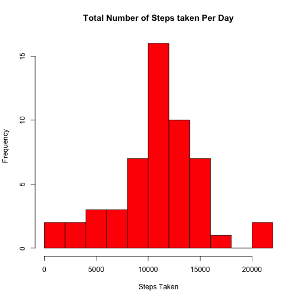
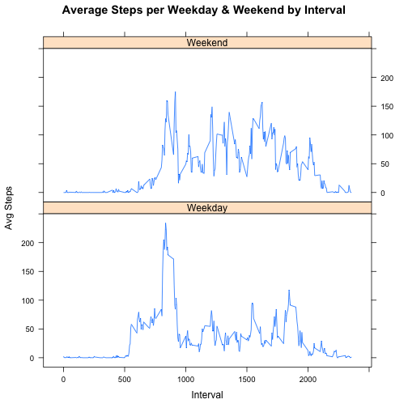

Reproducible Research: Peer Assessment 1
---------------------------------------------------------------------

## Set Global Variable
As we are required to display our codes to allow anyone to able to read the code, the echo = TRUE flag is set as a global variable which applies throughout the whole report.

```r
library(knitr)
opts_chunk$set(echo = TRUE)
```

## Loading and preprocessing the data
We will check if there already exist activity.csv file. If no, we will proceed to unzip the activity.zip to get activity.csv file to be loaded.


```r
if(!file.exists("./data")) { dir.create("./data") }

if(!file.exists("./data/activity.csv")) { 
        if(!file.exists("./activity.zip")) { 
                fileUrl <- "https://d396qusza40orc.cloudfront.net/repdata%2Fdata%2Factivity.zip"
                download.file(fileUrl,destfile="./activity.zip",method="curl")
                ## Remove "fileUrl" variable from Global Environment
                rm(fileUrl)
        } 
        unzip("./activity.zip", overwrite = TRUE, exdir = "./data")
}

activityData <- read.csv("./data/activity.csv")
```

To aid in the analysis later, the date and interval column is combined into a new column named 'DateTime'.

```r
timeFormatted <- as.POSIXct(strptime(paste(sprintf("%02d", floor(activityData$interval/100)), 
                                           sprintf("%02d", (activityData$interval %% 100)), 
                                           rep.int(sprintf("%02d",0), nrow(activityData)), sep=":"),
                                           format="%H:%M:%S"))
## Retrieve only time from the above formatted time
timestamp <- strftime(timeFormatted, format="%H:%M:%S")
dateTime <- paste(as.character(activityData$date), timestamp, sep = " ")
activityData <- cbind(activityData,  dateTime)
## Look at the data to make sure the above code perform as expected
str(activityData)
```

```
## 'data.frame':	17568 obs. of  4 variables:
##  $ steps   : int  NA NA NA NA NA NA NA NA NA NA ...
##  $ date    : Factor w/ 61 levels "2012-10-01","2012-10-02",..: 1 1 1 1 1 1 1 1 1 1 ...
##  $ interval: int  0 5 10 15 20 25 30 35 40 45 ...
##  $ dateTime: Factor w/ 17568 levels "2012-10-01 00:00:00",..: 1 2 3 4 5 6 7 8 9 10 ...
```

## What is mean total number of steps taken per day?
We will create a histogram to display the number of steps taken each day

```r
totalStepsPerDay <- aggregate(steps ~ date, activityData, sum)
hist(totalStepsPerDay$steps, col = "red", main = "Total Number of Steps taken Per Day", 
     xlab = "Steps Taken", ylab = "Frequency", breaks = 10)
```

 

Calculate the mean total number of steps taken per day

```r
meanStepsPerDay <- mean(totalStepsPerDay$steps)
meanStepsPerDay
```

```
## [1] 10766.19
```

Calculate the median of total number of steps taken per day

```r
medianStepsPerDay <- median(totalStepsPerDay$steps)
medianStepsPerDay
```

```
## [1] 10765
```

## What is the average daily activity pattern?
Plotting a time series of 5-minutes interval and the average number of steps taken, averaged across all days


```r
avgStepsPerInterval <- aggregate(activityData$steps, by = list(interval = activityData$interval), 
                              mean, na.rm=TRUE)
names(avgStepsPerInterval) <- c("interval","steps")
plot(avgStepsPerInterval, type = "l", xlab = "5-minutes interval", 
     ylab = "Avg. Number of of steps taken across all days", main = "Average Daily Activity Pattern")
```

 

Identifying which interval has the most number of steps taken.

```r
maxStepsInterval <- avgStepsPerInterval[which.max(avgStepsPerInterval$steps), 1]
maxStepsInterval
```

```
## [1] 835
```
The 5-minutes interval contains the maximum number of steps is 835

## Imputing missing values
Calculate the total number of missing values in the activity dataset

```r
totalMissingValues <- sum(!(complete.cases(activityData$steps)))
```
Total number of missing values in dataset is 2304

To replace the missing values, we decided to go with the mean for that 5-minutes interval.

```r
## Create a function to replace the missing values based on the mean for that 5-minutes interval
replaceValue <- function (dataset, mean) {
    index <- which(is.na(dataset$steps))
    replace <- unlist(lapply(index, FUN=function(replacementIndex){
        mean[mean$interval == dataset[replacementIndex,]$interval,]$steps
    }))
    imputedSteps <- dataset$steps
    imputedSteps[index] <- replace
    imputedSteps
}
```

Create a new dataset that with imputed data for all missing value.

```r
## Create a new dataset with missing values replaced
activityImputedData <- activityData
activityImputedData$steps <- replaceValue(activityImputedData, stepsPerInterval)
```

```
## Error in FUN(c(1L, 2L, 3L, 4L, 5L, 6L, 7L, 8L, 9L, 10L, 11L, 12L, 13L, : object 'stepsPerInterval' not found
```

```r
activityImputedData$steps <- activityImputedData$steps
```

To ensure that all missing data are filled, by performing a count of all missing data in the new dataset

```r
missingValuesLeft <- sum(is.na(activityImputedData$steps))
missingValuesLeft
```

```
## [1] 2304
```

Creates a histogram to display the number of steps taken each day for the dataset without missing values

```r
imputedStepsPerDay <- aggregate(steps ~ date, activityImputedData, sum)
hist(imputedStepsPerDay$steps, col = "green", main = "Total Steps taken Per Day with Impute Values", 
     xlab = "Steps Taken", ylab = "Frequency", breaks = 10)
```

 

Calculate mean and median of the new imputed dataset

```r
imputedMeanStepsPerDay <- mean(imputedStepsPerDay$steps)
imputedMeanStepsPerDay
```

```
## [1] 10766.19
```

```r
imputedMedianStepsPerDay <- median(imputedStepsPerDay$steps)
imputedMedianStepsPerDay
```

```
## [1] 10765
```

Before replacing the missing values:
Mean: 1.0766189 &times; 10<sup>4</sup>
Median: 10765

After replacing the missing values:
Mean: 1.0766189 &times; 10<sup>4</sup>
Median: 10765

From the values of the mean and median before and after replacing the missing values, we can conclude that the mean did not change. However, there is a slight increase in the median. While the impact of replacing the missing values result in increase in the median, it does not affect the prediction as shown in the 2 histograms which shows normal distribution in both cases.

## Are there differences in activity patterns between weekdays and weekends?
Creating factor variable in the dataset with 2 levels indicating whether a given date in the dataset is a weekday or a weekend. 

```r
day_type <- function(date){
  if(weekdays(as.Date(date)) %in% c("Sunday","Saturday")){
      "Weekend"
  }
  else{
      "Weekday"
  }
}
activityImputedData$day <- as.factor(sapply(activityImputedData$date, day_type))
```

Plotting a time series of 5-minutes interval and the average number of steps taken, averaged across all weekday days and weekend days.

```r
imputedStepsPerDayType <- aggregate(steps ~ interval + day, activityImputedData, mean)
library(lattice)
xyplot(imputedStepsPerDayType$steps ~ imputedStepsPerDayType$interval|imputedStepsPerDayType$day, 
       main="Average Steps per Weekday & Weekend by Interval", xlab ="Interval", ylab ="Avg Steps",
       layout=c(1,2), type ="l")
```

 

Based on the time series plotted, observation can be made that the activities for both weekdays and weekends differs. For weekdays, there is a peak in the morning while during weekends, the activities start at a later part of the day and the overall number of steps taken is more than that logged for weekday. 


